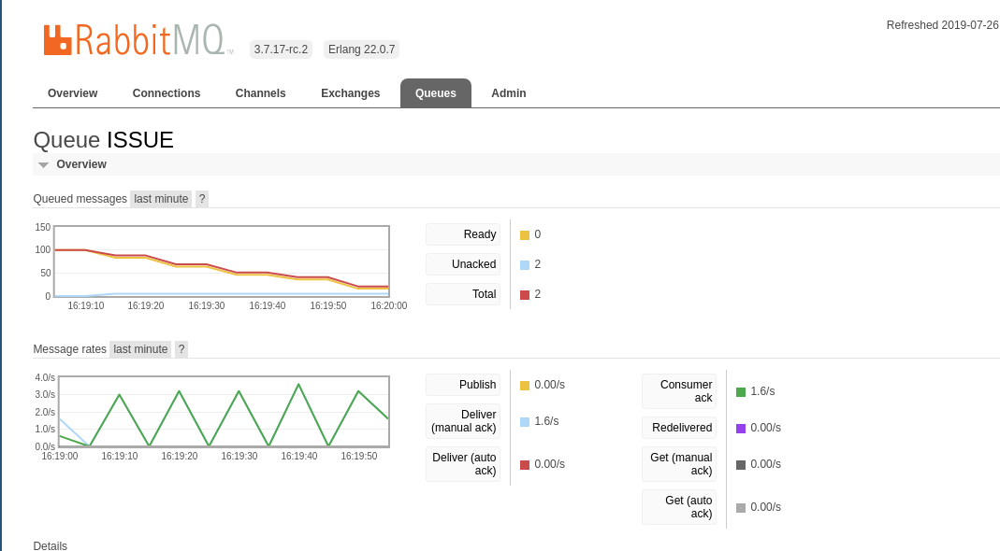

# Transaction Processor

This project tests the upper limit of the number of transactions that a single OpenAttestation [DocumentStore](https://github.com/OpenCerts/certificate-store-contract) can take. The project make use of a rabbitmq server to queue the jobs. There are two main component to the project, a `Job Creator` and a `Job Processor`.

## RabbitMQ Server

The rabbitmq server is used as the queue manager for the ISSUE and REVOKE jobs. A docker-compose file is created in the root directory for launching the rabbitmq server.

The management console is available at `http://localhost:15672` and the username and password are `rabbitmq`.

To run the rabbitmq server:

```
docker-compose up -d
```

## Job Creator

The role of the Job Creator is to create ISSUE/REVOKE jobs in the rabbitmq server. While it's role is to create as many jobs, it does not flood the queue with excessive number of jobs.

It constantly polls the rabbitmq management server at the interval `pollingTime` (in milliseconds) to check if the number of jobs fall below `queueLimit`.

Therefore, the maximum flow rate of jobs into the queue is simply `queueLimit * 1000/pollingTime` jobs per second.

To run the Job Creator to create jobs in ISSUE queue:

```
DEBUG=producer* node . createJobs ISSUE
```

To run the Job Creator to create jobs in REVOKE queue:

```
DEBUG=producer* node . createJobs REVOKE
```

## Job Processor

The role of the Job Processor is to process the job queues. It takes a job and send create a corresponding Ethereum transaction to issue or revoke the hash.

The job processor can choose to either wait for a transaction to be mined before moving to the next or move on to another transaction once the previous has been received by an Ethereum node. By allowing the job processor to not wait for the previous transaction to be mined, multiple transactions can be processed in a single block. However, there is no confirmation that the transaction will eventually be processed by the node - the transaction can be dropped.

The Job Processor comes in three flavors, `SimpleDocumentStore`, `BulkDocumentStore` and `MultisigDocumentStore`:

### SimpleDocumentStore

In the `SimpleDocumentStore` mode, the private key provided to the CLI is for the account owned the DocumentStore directly. ISSUE & REVOKE transactions are sent directly to the DocumentStore smart contract. In this mode, only one instance of the wallet is allowed to process the job queue.

To run the Job Processor to ISSUE documents:

```
DEBUG=consumer* node . processJobs ISSUE SIMPLE\
    <DOCUMENT STORE ADDRESS> \
    <PRIVATE KEY>
```

To run the Job Processor to REVOKE documents:

```
DEBUG=consumer* node . processJobs REVOKE SIMPLE\
    <DOCUMENT STORE ADDRESS> \
    <PRIVATE KEY>
```

### BulkDocumentStore

In the `BulkDocumentStore` mode, the private key provided to the CLI is for the account owned the DocumentStore directly. ISSUE & REVOKE transactions are sent directly to the DocumentStore smart contract. The difference with the `SimpleDocumentStore` mode is that the DocumentStore deployed is an experimental version of the document store with additional functions to bulk issue and bulk revoke. See below for the contract code. In this mode, only one instance of the wallet is allowed to process the job queue.

To run the Job Processor to ISSUE documents:

```
DEBUG=consumer* node . processJobs ISSUE BULK\
    <DOCUMENT STORE ADDRESS> \
    <PRIVATE KEY>
```

To run the Job Processor to REVOKE documents:

```
DEBUG=consumer* node . processJobs REVOKE BULK\
    <DOCUMENT STORE ADDRESS> \
    <PRIVATE KEY>
```

### MultisigDocumentStore

In the `MultisigDocumentStore` mode, the private key provided to the CLI is for the account that is allowed to send transactions to a [Gnosis Multisig Wallet](https://github.com/gnosis/MultiSigDocumentStore) instance. ISSUE & REVOKE transactions are instead sent to the multisig wallet to be processed. In this mode, we can add many different wallets to the same multisig wallet (with 1 required confirmation) to allow many different wallets to ISSUE and REVOKE documents at the same time. Parallel processing yay!

To run the Job Processor to ISSUE documents:

```
DEBUG=consumer* node . processJobs ISSUE MULTISIG \
    <DOCUMENT STORE ADDRESS> \
    <PRIVATE KEY> \
    <MULTISIG WALLET ADDRESS>
```

To run the Job Processor to REVOKE documents:

```
DEBUG=consumer* node . processJobs REVOKE MULTISIG\
    <DOCUMENT STORE ADDRESS> \
    <PRIVATE KEY> \
    <MULTISIG WALLET ADDRESS>
```

## Test Results



In a benchmark test on Ropsten, we are able to process `100` document issuance transactions in `1 minute 6 seconds`. In that test, we make use of `5` concurrent workers to process the job queue.

## Experimental Contract

Some of the interface uses a custom Document Store contract that supports looping through an array of byte32 hashes to issue/revoke them. The contract has not been throughly tested and is not available on admin.opencerts.io yet. To use the bulk feature, you will need to deploy the contract manually. The contract code is as followed:

```
pragma solidity ^0.4.24;

import "./Ownable.sol";

contract DocumentStore is Ownable {
  string public name;
  string public version = "2.2.0";

  /// A mapping of the document hash to the block number that was issued
  mapping(bytes32 => uint) documentIssued;
  /// A mapping of the hash of the claim being revoked to the revocation block number
  mapping(bytes32 => uint) documentRevoked;

  event DocumentIssued(bytes32 indexed document);
  event DocumentRevoked(
    bytes32 indexed document
  );

  constructor(
    string _name
  ) public
  {
    name = _name;
  }

  function issue(
    bytes32 document
  ) public onlyOwner onlyNotIssued(document)
  {
    documentIssued[document] = block.number;
    emit DocumentIssued(document);
  }

  function bulkIssue(
    bytes32[] documents
  ) public {
    for (uint i = 0; i < documents.length; i++) {
      issue(documents[i]);
    }
  }

  function getIssuedBlock(
    bytes32 document
  ) public onlyIssued(document) view returns (uint)
  {
    return documentIssued[document];
  }

  function isIssued(
    bytes32 document
  ) public view returns (bool)
  {
    return (documentIssued[document] != 0);
  }

  function isIssuedBefore(
    bytes32 document,
    uint blockNumber
  ) public view returns (bool)
  {
    return documentIssued[document] != 0 && documentIssued[document] <= blockNumber;
  }

  function revoke(
    bytes32 document
  ) public onlyOwner onlyNotRevoked(document) returns (bool)
  {
    documentRevoked[document] = block.number;
    emit DocumentRevoked(document);
  }

  function bulkRevoke(
    bytes32[] documents
  ) public {
    for (uint i = 0; i < documents.length; i++) {
      revoke(documents[i]);
    }
  }


  function isRevoked(
    bytes32 document
  ) public view returns (bool)
  {
    return documentRevoked[document] != 0;
  }

  function isRevokedBefore(
    bytes32 document,
    uint blockNumber
  ) public view returns (bool)
  {
    return documentRevoked[document] <= blockNumber && documentRevoked[document] != 0;
  }

  modifier onlyIssued(bytes32 document) {
    require(isIssued(document), "Error: Only issued document hashes can be revoked");
    _;
  }

  modifier onlyNotIssued(bytes32 document) {
    require(!isIssued(document), "Error: Only hashes that have not been issued can be issued");
    _;
  }

  modifier onlyNotRevoked(bytes32 claim) {
    require(!isRevoked(claim), "Error: Hash has been revoked previously");
    _;
  }
}
```

### Resources

- OpenAttestation DocumentStore Admin Panel - [admin.opencerts.io](https://admin.opencerts.io)
- Gnosis Multisig Wallet Admin Panel - [wallet.gnosis.pm](https://wallet.gnosis.pm)
